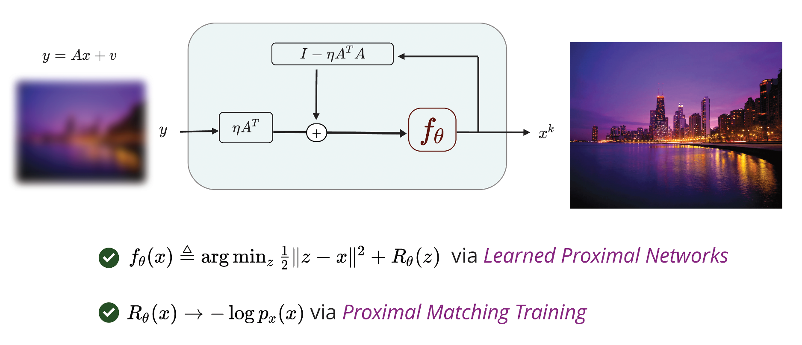
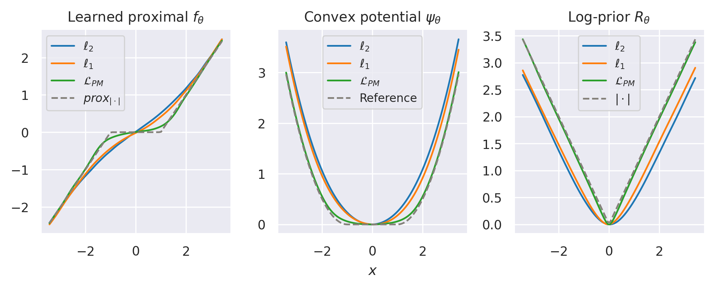
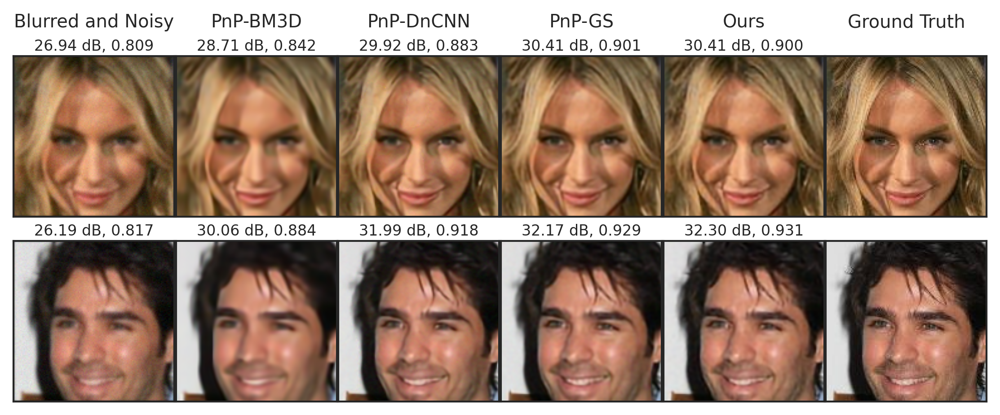
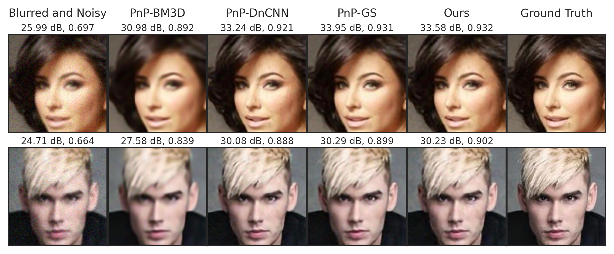
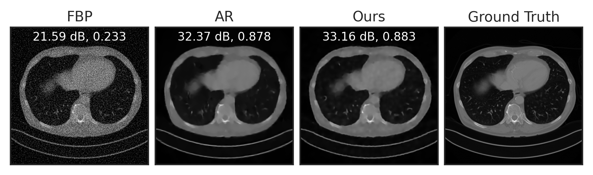
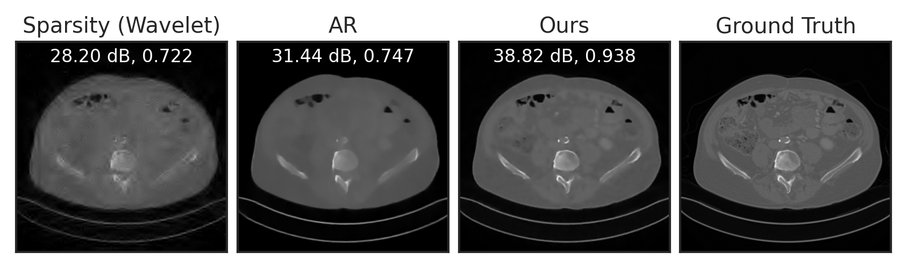

# What's in a Prior? Learned Proximal Networks for Inverse Problems

[](https://github.com/psf/black)

This is the official implementation of the paper [What's in a Prior? Learned Proximal Networks for Inverse Problems](https://openreview.net/pdf?id=kNPcOaqC5r) @ [ICLR 2024](https://iclr.cc/Conferences/2024)

by [Zhenghan Fang](https://zhenghanfang.github.io/), [Sam Buchanan](https://sdbuchanan.com/), and [Jeremias Sulam](https://sites.google.com/view/jsulam)

[[`Paper`](https://openreview.net/pdf?id=kNPcOaqC5r)] [[`Project`](https://zhenghanfang.github.io/learned-proximal-networks/)] [[`Talk`](https://iclr.cc/virtual/2024/poster/17978)] [[`Slides`](https://slides.com/zhenghanfang/iclr2024/fullscreen)] [[`Poster`](https://iclr.cc/media/PosterPDFs/ICLR%202024/17978.png?t=1714588084.3620567)] [[`BibTeX`](#references)]

--------------------



We propose *learned proximal networks* (LPN), a new class of deep neural networks that *exactly implement the proximal operator* of a general learned function. Such an LPN implicitly learns a regularization function for inverse problems that can be characterized and evaluated, shedding light onto what has been learned from data and improving the interpretability of learning-based solutions. In turn, we present a new training problem, dubbed *proximal matching*, that provably promotes the recovery of the correct regularization term (i.e., the log of the data distribution). Moreover, we show convergence for PnP reconstruction algorithms using LPN with minimal and verifiable assumptions.


- Laplacian example: the proximal operator $f_\theta$ and log-prior $R_\theta$ learned by LPN for the Laplacian distribution, trained via the $\ell_2$, $\ell_1$, or proximal matching ($\mathcal{L}_{PM}$) loss.


<!--  -->

- Deblurring on CelebA, $\sigma_{blur}=1.0$, $\sigma_{noise}=0.02$



- Deblurring on CelebA, $\sigma_{blur}=1.0$, $\sigma_{noise}=0.04$



- Sparse-view tomographic reconstruction on MayoCT



- Compressed sensing on MayoCT (compression rate = 1/16)




## Installation
The code is implemented with Python 3.9.16 and PyTorch 1.12.0. Install the conda environment by

```
conda env create -f environment.yml
```

Install the `lpn` package

```
pip install -e .
```

## Dataset Preparation

The datasets are placed in `data/` folder.

### MNIST

The dataset is already in `data/mnist` with the following structure:

```
data/
└── mnist
    ├── labels.npy
    └── mnist.npy
```

### CelebA

Download files of the CelebA dataset, as defined in the filelist in [torchvision](https://github.com/pytorch/vision)'s CelebA class:

`img_align_celeba.zip, list_attr_celeba.txt, identity_CelebA.txt, list_bbox_celeba.txt, list_landmarks_align_celeba.txt, list_eval_partition.txt`

directly from the authors' [google drive link](https://drive.google.com/drive/folders/0B7EVK8r0v71pWEZsZE9oNnFzTm8?resourcekey=0-5BR16BdXnb8hVj6CNHKzLg&usp=drive_link), and place them in `data/celeba/celeba`. Unzip `img_align_celeba.zip`. You may use the following commands to download the files automatically:

```
pip install gdown
mkdir data/celeba/celeba
cd data/celeba/celeba
gdown --id 0B7EVK8r0v71pZjFTYXZWM3FlRnM
gdown --id 0B7EVK8r0v71pY0NSMzRuSXJEVkk
gdown --id 0B7EVK8r0v71pTzJIdlJWdHczRlU
gdown --id 0B7EVK8r0v71pd0FJY3Blby1HUTQ
gdown --id 0B7EVK8r0v71pbThiMVRxWXZ4dU0
gdown --id 0B7EVK8r0v71pblRyaVFSWGxPY0U
gdown --id 1_ee_0u7vcNLOfNLegJRHmolfH5ICW-XS
unzip img_align_celeba.zip
```

The resulting directory should have the following structure:

```
data/
└── celeba
    └── celeba
        ├── img_align_celeba (unzipped from img_align_celeba.zip)
        ├── identity_CelebA.txt
        ├── list_attr_celeba.txt
        ├── list_bbox_celeba.txt
        ├── list_eval_partition.txt
        └── list_landmarks_align_celeba.txt
```

### MayoCT

Download the dataset from the authors' [google drive link](https://drive.google.com/drive/folders/1gKytBtkTtGxBLRcNInx2OLty4Gie3pCX?usp=sharing), and place it in `data/mayoct`. See the authors' [github repo](https://github.com/Subhadip-1/unrolling_meets_data_driven_regularization) and [paper](https://arxiv.org/abs/2106.03538) for more details.

The resulting directory should have the following structure:

```
data/
└── mayoct
    └── mayo_data_arranged_patientwise
        ├── test
        │   ├── FBP
        │   ├── Phantom
        │   └── Sinogram
        └── train
            ├── FBP
            ├── Phantom
            └── Sinogram
```

## How to Run the Code

Code of the main functionalities of LPN is placed in the `lpn` folder.

Code for repoducing the experiments in the paper is placed in the `exps` folder.

### Laplacian Experiment

To reproduce the Laplacian experiment, use code in `exps/laplacian/`.

1. Train: `laplacian_train.ipynb`

2. Test: `laplacian_test.ipynb`

3. Visualize results

- Plot Fig. 1 in the paper: `viz_compact.ipynb`
- Plot Fig. 6 in the supplementary of paper: `viz_supp.ipynb`

Outputs (figures, models, and results) will be saved in `exps/laplacian/experiments/`.

### MNIST Experiment

Code for reproducing the MNIST experiment is in `exps/mnist/`.

1. Train:

```
bash exps/mnist/train_mnist.sh
```

- Model will be saved at `exps/mnist/experiments/mnist/model.pt`.

- We also provide the [pretrained model](#pretrained-checkpoints).

2. Compute prior:

```
bash exps/mnist/prior_mnist.sh
```

- Results will be saved in `exps/mnist/experiments/mnist/prior`.


3. Visualize results (Figures 3 and 7 in paper)

- Learned prior at example images: `notebooks/viz_img_and_prior.ipynb`

- Violin plot over all images: `notebooks/viz_violin.ipynb`

- Set `perturb_mode` in the notebooks to `gaussian`, `convex`, or `blur` for different perturbation modes.

- Figures will be saved in `exps/mnist/experiments/mnist/figures`.

### CelebA Experiment

Code for reproducing the CelebA experiment is in `exps/celeba/`.

1. Train:

```
bash exps/celeba/train.sh
```

- Two models will be trained with different noise levels (0.05 and 0.1), saved in `exps/celeba/models/lpn/s={0.05, 0.1}/model.pt`.

- We also provide the [pretrained models](#pretrained-checkpoints).

2. Deblurring using trained LPN:

```
python exps/celeba/test.py --sigma_blur [BLUR LEVEL] --sigma_noise [NOISE LEVEL]
```

- E.g., `python exps/celeba/test.py --sigma_blur 1.0 --sigma_noise 0.02` will run deblurring using LPN for Gaussian kernel with standard deviation of $\sigma_{blur}=1.0$ and noise std of $\sigma_{noise}=0.02$.
- `sigma_blur` can be chosen from {1.0, 2.0}, `sigma_noise` can be chosen from {0.02, 0.04}.
- Results will be saved in `exps/celeba/results/inverse/deblur/blur=[BLUR LEVEL]_noise=[NOISE LEVEL]/admm/lpn/{x,y,xhat}`. `x` and `y` contain the clean images and blurred observation, respectively. `xhat` contains the deblurred images.

<!-- 3. Visualize

- Figures: `notebooks/reports/celeba/viz_deblur.ipynb`

- Numerical results: `notebooks/reports/celeba/table_deblur.ipynb` -->

### MayoCT Experiment

Code for reproducing the MayoCT experiment is in `exps/mayoct/`.

1. Train:

```
bash exps/mayoct/train.sh
```

- Model will be saved in `exps/mayoct/models/lpn/s=0.1`.

- We also provide the [pretrained model](#pretrained-checkpoints).

2. Tomography reconstruction using LPN:

```
python exps/mayoct/inverse_mayoct_tomo.py
```

- Results will be saved in `exps/mayoct/results/inverse/mayoct/tomo/num_angles=200_det_shape=400_noise=2.0/lpn`. `x`: ground truth, `y`: measurements, `xhat`: LPN reconstruction, `fbp`: FBP reconstruction. Average PSNR and SSIM of LPN reconstructions are saved in `xhat/recon_log.txt`.

3. Compressed sensing (CS) using LPN:

```
bash exps/mayoct/test_cs.sh
```

- Results will be saved in `exps/mayoct/results/inverse/mayoct/cs/M=[NUM OF MEASUREMENTS]_noise=0.001/lpn`. `x`: ground truth, `y`: measurements, `xhat`: LPN reconstruction, `ls`: least squares reconstruction. Average PSNR and SSIM of LPN reconstructions are saved in `xhat/recon_log.txt`.

<!-- 4. Visualize

- Figures: `experiments_code/ct/notebooks/vis_ct_{cs, ct}.ipynb`

- Numerical results: `experiments_code/ct/notebooks/table.ipynb` -->

## Pretrained checkpoints

All checkpoints are provided in this [Google drive](https://drive.google.com/drive/folders/1qtOra7EDas8gDXGHMsCfSjjIqdvnnb5E?usp=sharing).

## Acknowledgements

- [scico](https://github.com/lanl/scico)
- [Prox-PnP](https://github.com/samuro95/Prox-PnP)
- [unrolling_meets_data_driven_regularization](https://github.com/Subhadip-1/unrolling_meets_data_driven_regularization)
- [odl](https://odlgroup.github.io/odl/)


## References

If you find the code useful, please consider citing
```bib
@inproceedings{
    fang2024whats,
    title={What's in a Prior? Learned Proximal Networks for Inverse Problems},
    author={Zhenghan Fang and Sam Buchanan and Jeremias Sulam},
    booktitle={The Twelfth International Conference on Learning Representations},
    year={2024}
}
```